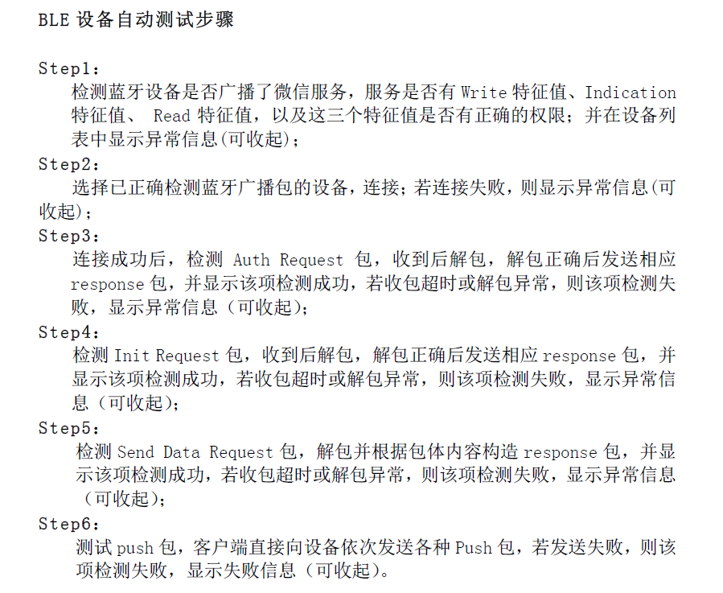

====================================
ble airsync
====================================

功能简介
==========

    airsync用于和微信airsync调试工具AirSync Debugger通信。

AirSync Debugger和ble设备交互流程
======================================

airsync是按照以上6个步骤实现的。

认证方式
==========

.. code:: c

    //#define EAM_MD5_NO_ENRYPT                        1  //auth method
    //#define EAM_MD5_ENRYPT                           1
    #define EAM_MAC_NO_ENCRYPT                       2

	认证方式为以上三种中的任意一种，当EAM_MD5_NO_ENRYPT和EAM_MD5_ENRYPT时，要在AirSync Debugger设置相应的DEVICE_ID,DEVICE_TYPE,DEVICE_KEY与代码一致。

广播出协议指定的数据
=======================

.. code:: c

    static void osapp_start_advertising()
    {
        adv_manuf_data_t manuf_dat = 
        {
            .manuf_id = COMPANY_IDENTIFIER,
        };
        memcpy(manuf_dat.local_addr, local_addr.addr.addr.addr, 6);
        uint8_t adv_svc_uuid[2] = WECHAT_SERVICE_ARRAY;
        struct gapm_start_advertise_cmd *cmd = AHI_MSG_ALLOC(GAPM_START_ADVERTISE_CMD,TASK_ID_GAPM, gapm_start_advertise_cmd);
        cmd->op.addr_src    = GAPM_STATIC_ADDR;
        cmd->channel_map    = APP_ADV_CHMAP;
        cmd->intv_min = APP_ADV_INT;
        cmd->intv_max = APP_ADV_INT;
        cmd->op.code        = GAPM_ADV_UNDIRECT;
        cmd->info.host.mode = GAP_GEN_DISCOVERABLE;
                // Flag value is set by the GAP
        cmd->info.host.adv_data_len = ADV_DATA_PACK(cmd->info.host.adv_data,3, \
            GAP_AD_TYPE_COMPLETE_NAME,WECHAT_SVC_ADV_NAME,sizeof(WECHAT_SVC_ADV_NAME), \
            GAP_AD_TYPE_MORE_16_BIT_UUID, adv_svc_uuid, ATT_UUID_16_LEN, \
            GAP_AD_TYPE_MANU_SPECIFIC_DATA, (uint8_t*)&manuf_dat, sizeof(adv_manuf_data_t));
        cmd->info.host.scan_rsp_data_len  = 0;
        os_ahi_msg_send(cmd,portMAX_DELAY);   
    }

协议规定要广播出指定服务和company id，local addr。

添加协议规定的服务
====================

.. code:: c

    
    struct gattm_svc_desc const wechat_svc_desc ={
            .start_hdl = 0,
            .task_id = TASK_ID_AHI,
            .perm = PERM(SVC_MI,DISABLE)|PERM(SVC_EKS,DISABLE)|\
                PERM(SVC_AUTH,NO_AUTH)|PERM(SVC_UUID_LEN,UUID_16),PERM_VAL(SVC_SECONDARY,0),
            .nb_att = WECHAT_SVC_ATT_NUM,
            .uuid = WECHAT_SERVICE_ARRAY,
    };

    struct gattm_att_desc const wechat_svc_att_db[WECHAT_SVC_ATT_NUM] = {
                [WECHAT_SVC_IDX_IND_CHAR] = {
                    .uuid = ATT_DECL_CHAR_ARRAY,
                    .perm = PERM(RD,ENABLE),
                    .max_len = 0,
                    .ext_perm= PERM(UUID_LEN,UUID_16),
                },
                [WECHAT_SVC_IDX_IND_VAL] = {
                    .uuid = WECHAT_INDICATE_CHARACTERISTICS_ARRAY,
                    .perm = PERM(IND,ENABLE),
                    .max_len = BLE_WECHAT_MAX_DATA_LEN,
                    .ext_perm = PERM(UUID_LEN,UUID_16)|PERM(RI,ENABLE),
                },
                [WECHAT_SVC_IDX_IND_CFG] = {
                    .uuid = ATT_DESC_CLIENT_CHAR_CFG_ARRAY,
                    .perm = PERM(RD,ENABLE)|PERM(WRITE_REQ,ENABLE),
                    .max_len = 0,
                    .ext_perm = PERM(UUID_LEN,UUID_16),
                },
                [WECHAT_SVC_IDX_WT_CHAR] = {
                    .uuid = ATT_DECL_CHAR_ARRAY,
                    .perm = PERM(RD,ENABLE),
                    .max_len = 0,
                    .ext_perm= PERM(UUID_LEN,UUID_16),
                },
                [WECHAT_SVC_IDX_WT_VAL] = {

                    .uuid = WECHAT_WRITE_CHARACTERISTICS_ARRAY,
                    .perm = PERM(WRITE_REQ,ENABLE)|PERM(WRITE_COMMAND,ENABLE)|PERM(WP,NO_AUTH),
                    .max_len = BLE_WECHAT_MAX_DATA_LEN,
                    .ext_perm = PERM(UUID_LEN,UUID_16)|PERM(RI,ENABLE),
                },
                [WECHAT_SVC_IDX_RD_CHAR] = {
                    .uuid = ATT_DECL_CHAR_ARRAY,
                    .perm = PERM(RD,ENABLE),
                    .max_len = 0,
                    .ext_perm= PERM(UUID_LEN,UUID_16),
                },
                [WECHAT_SVC_IDX_RD_VAL] = {
                    .uuid = WECHAT_READ_CHARACTERISTICS_ARRAY,
                    .perm = PERM(RD,ENABLE)|PERM(RP,NO_AUTH),
                    .max_len = BLE_WECHAT_MAX_DATA_LEN,
                    .ext_perm = PERM(UUID_LEN,UUID_16)|PERM(RI,ENABLE),
                },
    };

airsync将该服务添加到自己的profile中，该服务是协议要求添加的。

用户API介绍
============

.. code:: c

    void send_auth_cmd_pack(void)
    {
        uint8_t* data_pack;
        uint32_t len_pack;
        cmd_info_t cmd_type = 
        {
            .cmd = CMD_AUTH,
        };
        cmd_proces_2_stream(&cmd_type, &data_pack, &len_pack);
        osapp_send_indication_wrap(data_pack, len_pack);
        vPortFree(data_pack);
    }

    void send_init_cmd_pack(void)
    {
        uint8_t* data_pack;
        uint32_t len_pack;
        cmd_info_t cmd_type = 
        {
            .cmd = CMD_INIT,
        };
        cmd_proces_2_stream(&cmd_type, &data_pack, &len_pack);
        osapp_send_indication_wrap(data_pack, len_pack);
        vPortFree(data_pack);
    }

    void send_dat_cmd_pack(const char* dat)
    {
        uint8_t* data_pack;
        uint32_t len_pack;
        cmd_info_t cmd_type = 
        {
            .cmd = CMD_SENDDAT,
            .send_msg = 
            {
                .len = strlen(dat)+1,
                .str = dat,
            },
        };
        cmd_proces_2_stream(&cmd_type, &data_pack, &len_pack);
        osapp_send_indication_wrap(data_pack, len_pack);
        vPortFree(data_pack);
    }

    int parse_recev_pkt(uint8_t *data_raw, uint32_t len_raw)
    {
        bp_fix_head_t *fix_head = (bp_fix_head_t *)data_raw;
        LOG_I("CMDID: %d", co_htons(fix_head->n_cmd_id));
        int ret = 0;
        switch(co_htons(fix_head->n_cmd_id))
        {
            case ECI_resp_auth:
                parse_resp_auth_ptk(data_raw, len_raw);
            break;
            case ECI_resp_init:
                parse_resp_init_ptk(data_raw, len_raw);
            break;
            case ECI_resp_sendData:
                parse_resp_send_dat_ptk(data_raw, len_raw);
            break;
            case ECI_push_recvData:
                ret = parse_push_recev_dat_ptk(data_raw, len_raw);
            break;
            case ECI_push_switchView:
                ret = parse_push_switch_view_ptk(data_raw, len_raw);
            break;
            case ECI_push_switchBackgroud:
                ret = parse_push_switch_backgnd_ptk(data_raw, len_raw);
            break;
            default:
                LOG_I("no response type");
            break;
        }
        vPortFree(data_raw);// free recev pack
        return ret;
    }

send_auth_cmd_pack()实现了上图中的Step3，ble设备发送auth包。send_init_cmd_pack()实现了上图中的Step4，ble设备发送init包。send_dat_cmd_pack()实现了上图中的Step5，ble设备发送data包。parse_recev_pkt()用来解析AirSync Debugger发过来的所有包。

