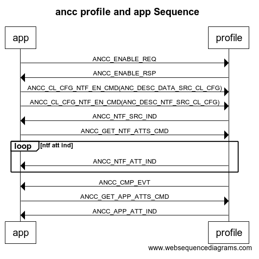

====================================
ble ancs client
====================================

功能简介
==========

ancs client用于和苹果手机通信，苹果手机上有一个ancs服务，可以将手机上的消息推送到与之绑定的蓝牙设备。在发现苹果手机上的ancs服务前，
必须要和苹果手机绑定，才能发现服务。苹果手机上的服务可能由于某些原因发生改变，这就需要绑定过的设备重新去发现ancs服务。当苹果手机的
服备发生改变时， 我们希望他能通知与之绑定过的设备服务已经发生了改变，这就需要设备去使能苹果手机的service changed char（通过将cccd
置1），由gattsc profile完成该过程。在添加ancc profile时，要注意在bx_app_config.h中定义相关宏，代码如下：

.. code:: c

    #ifndef BX_APP_CONFIG_H_
    #define BX_APP_CONFIG_H_

    #define CFG_PRF_ANCC
    #define BLE_GATTS_CLIENT

    #endif

IOS设备和ble设备交互流程
===================================

ble 添加 profile
======================

.. code:: c

    static void osapp_add_ancc_task()
    {
        struct gapm_profile_task_add_cmd *req=AHI_MSG_ALLOC(GAPM_PROFILE_TASK_ADD_CMD, TASK_ID_GAPM, gapm_profile_task_add_cmd);
        req->operation = GAPM_PROFILE_TASK_ADD;
        req->sec_lvl = PERM(SVC_AUTH,NO_AUTH);
        req->prf_task_id = TASK_ID_ANCC;
        req->app_task = TASK_AHI;
        req->start_hdl = 0;
        os_ahi_msg_send(req,portMAX_DELAY);
    }

    static void osapp_add_gattsc_task(void)
    {
        struct gapm_profile_task_add_cmd *req=AHI_MSG_ALLOC(GAPM_PROFILE_TASK_ADD_CMD, TASK_ID_GAPM, gapm_profile_task_add_cmd);
        req->operation = GAPM_PROFILE_TASK_ADD;
        req->sec_lvl = PERM(SVC_AUTH,NO_AUTH);
        req->prf_task_id = TASK_ID_GATTSC;
        req->app_task = TASK_AHI;
        req->start_hdl = 0;
        os_ahi_msg_send(req,portMAX_DELAY);
    }

ble 协议栈和应用协议栈的信息交互
==================================

**1. profile和应用的交互**

.. code:: c

    static osapp_msg_handler_table_t const handler_table[]=
    {
    //gapm
        {GAPM_PROFILE_ADDED_IND,(osapp_msg_handler_t)osapp_gapm_profile_added_ind_handler},
        {GAPM_CMP_EVT,(osapp_msg_handler_t)osapp_gapm_cmp_evt_handler},
        {GAPC_DISCONNECT_IND,(osapp_msg_handler_t)osapp_gapc_disconnect_ind_handler},
        {GAPC_GET_DEV_INFO_REQ_IND,(osapp_msg_handler_t)osapp_gapc_get_dev_info_req_ind_handler},
    //profile
        {ANCC_ENABLE_RSP,(osapp_msg_handler_t)osapp_ancc_enable_rsp_handler},
        {ANCC_CMP_EVT,(osapp_msg_handler_t)osapp_ancc_cmp_evt_handler},
        {ANCC_NTF_ATT_IND,(osapp_msg_handler_t)osapp_ancc_ntf_att_ind_handler},
        {ANCC_APP_ATT_IND,(osapp_msg_handler_t)osapp_ancc_app_att_ind_handler},
        {ANCC_NTF_SRC_IND,(osapp_msg_handler_t)osapp_ancc_ntf_src_ind_handler},
    //gattsc
        {GATTSC_ENABLE_RSP,(osapp_msg_handler_t)osapp_gattsc_enable_rsp_handler},
        {GATTSC_SVC_CHANGED_IND,(osapp_msg_handler_t)osapp_gattsc_svc_chaged_handler},
        {GATTSC_CMP_EVT,(osapp_msg_handler_t)osapp_gattsc_cmp_evt_handler},
    };

profile和app的交互流程如下图所示：

profile是app和协议栈的中间层，有了profile，app和协议栈的交互容易得多，app只需要发送一条profile task add命令，profile就可以帮助app完成很多事，
比如构建profile、处理来自对端设备的消息，然后再将处理的结果返回给app。对于ancs，APP首先发送一条ANCC_ENABLE_REQ请求给profile，profile开始去发
现ios设备上的ancs，服务发现完成后返回ANCC_ENABLE_RSP响应给APP，该响应包含ANCS的全部信息，比如database,svc desc等，APP会将这些信息保存在flash
中，便于下次重连使用，当再次与绑定过的ios设备连接时，可以直接从flash中取出ancs的相关信息，而不用再次去发现ANCS服务。
ancs内容如下：

.. code:: c

    struct ancc_anc_content
    {
        struct prf_svc svc;
        struct prf_char_inf chars[ANC_CHAR_MAX];
        struct prf_char_desc_inf descs[ANC_DESC_MAX];
    };

接着，APP向profile发送ANCC_CL_CFG_NFT_EN_CMD，用于使能IOS设备上的CCCD，允许通知，先使能DATA SRC，再使能NTF SRC。
将这些配置完成后，就可以接收来自ios设备的通知了。IOS设备首先会把ntf src char通知给与之绑定的设备，ntf src char内容如下：

.. code:: c

    struct anc_ntf_src
    {
        /// Event ID
        uint8_t event_id;

        /// Event Flags
        uint8_t event_flags;

        /// Category ID
        uint8_t cat_id;

        /// Category Count: Number of active notifications in the given category
        uint8_t cat_cnt;

        /// Notification UID
        uint32_t ntf_uid;
    };

收到ntf src char通知后，设备可以执行一些动作去帮助IOS设备完成某些功能，比如cat_id是一条来电通知，可以发送一条ANCC_PERFORM_NTF_ACTION_CMD给profile去使IOS设备接听/拒绝来电。
也可以去获得更多关于这条通知的信息，在ANCS中，有一个control point特征，可以向这个特征中写入一些命令，用于获取通知的更多信息，使用ANCC_GET_NTF_ATTS_CMD去获取app id, title,
msg, positive action label, negative action label属性，代码如下：

.. code:: c

    static void osapp_ancc_get_ntf_atts(uint8_t catid,uint32_t ntf_uid,ke_task_id_t const src_id)
    {
        struct ancc_get_ntf_atts_cmd *cmd = AHI_MSG_ALLOC(ANCC_GET_NTF_ATTS_CMD,src_id,ancc_get_ntf_atts_cmd);
        cmd->ntf_uid = ntf_uid;
        cmd->att_mask =  1 << NTF_ATT_ID_APP_ID| 1 << NTF_ATT_ID_TITLE | 1 << NTF_ATT_ID_MSG | 1 << NTF_ATT_ID_POS_ACTION_LABEL | 1 << NTF_ATT_ID_NEG_ACTION_LABEL;
        cmd->title_length =  20;
        cmd->subtitle_length = 0 ;
        cmd->message_length =  20;
        os_ahi_msg_send(cmd,portMAX_DELAY);
    }

当获取到app id属性时，可以向profile发送ANCC_GET_APP_ATTS_CMD，用于获取更详细的信息，代码如下：

.. code:: c

    static void osapp_ancc_get_app_atts(uint16_t length, const uint8_t* value,ke_task_id_t const src_id)
    {
        struct ancc_get_app_atts_cmd *cmd = AHI_MSG_ALLOC(ANCC_GET_APP_ATTS_CMD,src_id,ancc_get_app_atts_cmd);
        cmd->att_mask =  1<<NTF_ATT_ID_APP_ID;
        memcpy(cmd->app_id.str,value,length);
        os_ahi_msg_send(cmd,portMAX_DELAY);
    }

对于service changed char，app首先发送GATTSC_ENABLE_REQ到gattsc profile， gattsc profile去发现对端的gatt的service changed char,然后再去使能cccd，允许指示。
当苹果手机上的服务发生变化时，会将发生变化的handle指示给与之绑定的设备，收到指示后，对比ancs服务的handle是否在该范围内，如果在，需要重新去发现ancs服务。