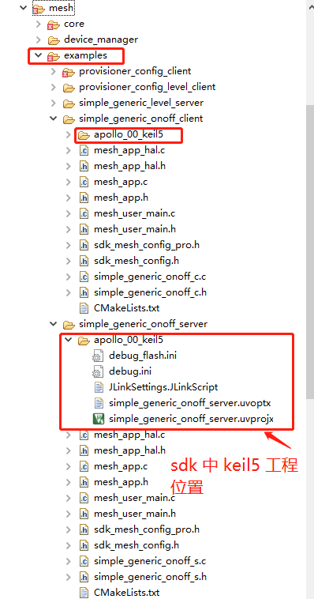
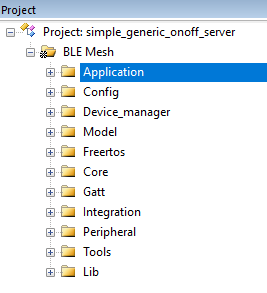

==============================================
BLE Mesh keil5 工程说明
==============================================

keil5 工程位置
==============================================

keil5 工程环境说明
==============================================

* Keil 5 环境下各个目录的含义和介绍，如下表所示：

+--------------------+---------------------------------------------------------------------------------------------------------------------+
|     目录           | 目录介绍                                                                                                            |
+====================+=====================================================================================================================+
|Application         | 本例程应用下，用户自己需要实现并修改的应用代码文件                                                                  |
+--------------------+---------------------------------------------------------------------------------------------------------------------+
|Config              | sdk中，跑本例程应用需要配置的参数文件                                                                               |
+--------------------+---------------------------------------------------------------------------------------------------------------------+
|Device_manager      | 各种密钥和地址，以及掉电存储相关的文件                                                                              |
+--------------------+---------------------------------------------------------------------------------------------------------------------+   
|Model               | 各种model的实现相关文件                                                                                             |
+--------------------+---------------------------------------------------------------------------------------------------------------------+  
|Freertos            | Freertos 相关的源代码                                                                                               |
+--------------------+---------------------------------------------------------------------------------------------------------------------+  
|Core                | mesh内核实现以及ble内核相关                                                                                         |
+--------------------+---------------------------------------------------------------------------------------------------------------------+
|Gatt                | mesh gatt相关的实现                                                                                                 |
+--------------------+---------------------------------------------------------------------------------------------------------------------+
|Integration         | 芯片平台下系统级驱动实现                                                                                            |
+--------------------+---------------------------------------------------------------------------------------------------------------------+   
|Peripheral          | 芯片平台下应用级驱动实现                                                                                            |
+--------------------+---------------------------------------------------------------------------------------------------------------------+
|Tools               | sdk 实现过程中的，各种公用软件工具相关文件                                                                          |
+--------------------+---------------------------------------------------------------------------------------------------------------------+  
|Lib                 | sdk 核心实现的库文件                                                                                                |
+--------------------+---------------------------------------------------------------------------------------------------------------------+    

* Keil 5 工程配置

     -  宏声明和路径包含

         .. image:: img/sdk_keil5_prj3.png
         
         keil5 环境中声明的宏，对应 bx_app_config.h中的宏定义，（bx_app_config.h里面的宏，用户自己默认是无需修改的）例如：
         
		.. code:: c
		
		  #ifdef B_APP_MESH_PROVISIONER_CONFIG_CLIENT
			#define OSAPP_MESH                                                  1       //enable mesh
			#define configTOTAL_HEAP_SIZE                                       ((size_t) ( 13* 1024 ) )
			#define DEEP_SLEEP_ENABLE                                           {0}     //disable sleep
			#define ENABLE_ADV_PAYLOD_31BYTE_PATCH                              1       //adv payload data max len 31byte 
		  #endif/*B_APP_MESH_PROVISIONER_CONFIG_CLIENT*/

     -  下载脚本配置

         .. image:: img/sdk_keil5_prj4.png

         - 3.3v flash 需要把图中字符串中的 prog_1v8.bat 设置成  prog_3v3.bat

         - 1.8v flash 默认keil5 环境中配置 prog_1v8.bat 就好

     -  编译生成的hex 文件和 bin文件位置

         .. image:: img/sdk_keil5_prj5.png

         - hex 用于直接烧录

         - bin 用于无线升级（后续支持）

keil5 工程环境下 Application 目录下用户代码详解
==============================================================
*  mesh_app.c 和 mesh_app.h
     用户应用用到的model实例化以及model相关的回调事件通知处理  【必须存在，不能修改文件名，库里会有相关引用】
*  mesh_user_main.c 和 mesh_user_main.h
     用户应用初始化入口，用户的自己参数初始化，硬件配置初始化可以放在这里执行  【必须存在，不能修改文件名，库里会有相关引用】
*  mesh_app_hal.c  
     用户应用硬件相关的动作逻辑处理实现  【用户可以任意修改】
*  其他例程相关的 .c 和 .h  文件 
     用户应用示例逻辑相关文件  【用户可以任意修改】

