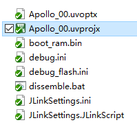
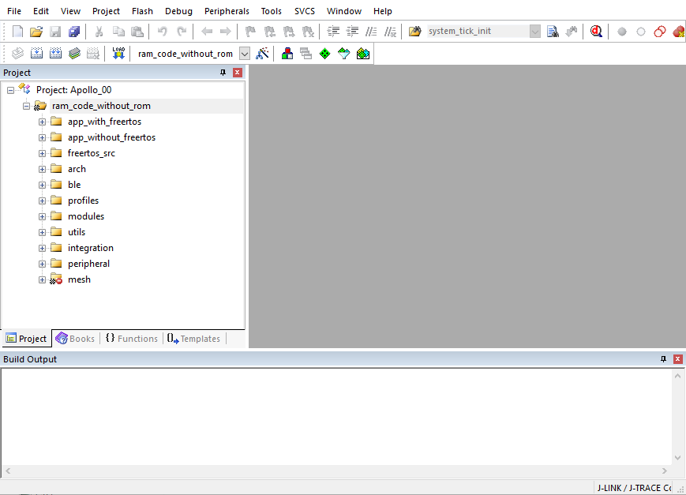

Compiling and running a first example
^^^^^^^^^^^^^^^^^^^^^^^^^^^^^^^^^^^^^^^^^^^^^^^^^^^

在开发自己的应用程序之前，需要在PC上验证是否已经完整安装所需要的工具链。安装工具链所需要的软件和步骤，请参考文档BX2400开发环境及工具链搭建指南。
工具链安装完备之后，可以打开BX2400 SDK里的Keil工程文件。

初次打开的BX2400 Keil工程如下：

对于BX2400调试，可以有两种调试方式：在SRAM中调试和在Flash中调试。对于刚刚上手的用户来说，推荐第一种方式。而对于在SRAM中已经将功能调试的差不多的用户来说，可以考虑第二种更贴近实际应用的调试方法。

1. SRAM调试

   在BX2400 SDK中，有若干APP Demo，初次上手的用户可以选择其中一个，编译链接并下载到开发板运行。

   a. 打开bx_sys_config.h，配置本地蓝牙地址

      #define BX_DEV_ADDR {0x91,0x22,0x33,0x44,0x55,0x66}

      该头文件里其余的配置项保持默认值。

   #. 打开osapp_config.h，选择一个APP的宏。推荐选择OSAPP_DIS_SERVER，在这个应用里，开发板会发带有广播数据的广播包，而扫描者（例如手机）可以扫描到该广播包，并建立连接。

      .. image:: compiling_and_running_the_first_example_img3.png

      注意：这里的宏必须打开一个，且只能打开一个

   #. 编译链接

      .. image:: compiling_and_running_the_first_example_img4.png

      完成之后，可以在Build Output里看到结果输出：

      .. image:: compiling_and_running_the_first_example_img5.png

   #. 配置Debug选项：

      .. image:: compiling_and_running_the_first_example_img6.png

      Debug选项中，需要修改初始化文件为debug.ini

   #. 下载axf文件到开发板中，并运行

      .. image:: compiling_and_running_the_first_example_img7.png

   #. 此时可以通过手机或者抓包器看到空中广播包：

      .. image:: compiling_and_running_the_first_example_img8.png

      注意：避免在同一环境中运行两个地址完全相同的蓝牙应用

   #. 此时可以在Keil环境里暂停/运行，设置断点，单步调试等。具体细节参见文档DEBUG环境
      
      注意：在BX2400里，某些特定状态下，Keil里无法执行上面的调试步骤，例如当IC在反复睡醒时，此时CPU处于关电状态，JLink无法连接到IC。

2. Flash调试

   Flash调试的前提是bin文件已经烧写入Flash中。关于如何烧写Flash，可以参考文档JFlash Tools

   Flash调试的大部分步骤与RAM调试相同，唯一需要改变的是Debug选项的配置：
      
   .. image:: compiling_and_running_the_first_example_img9.png

   在RAM中直接调试，初始化文件为debug.ini，而Flash调试的初始化文件为debug_flash.ini。

