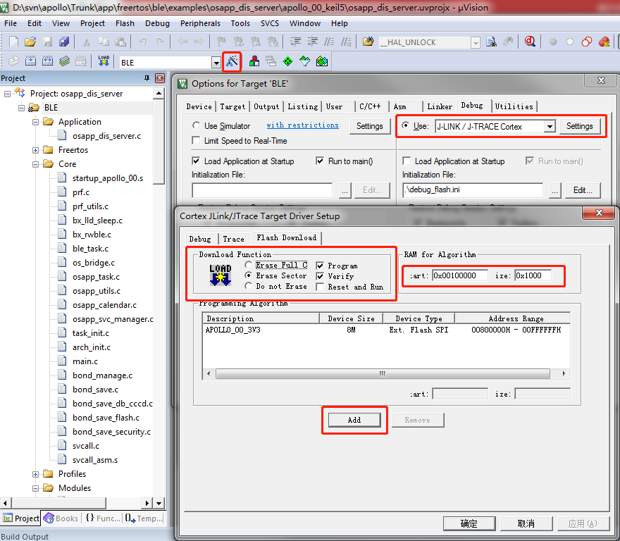
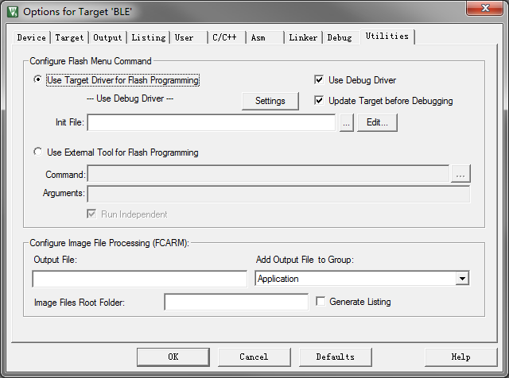
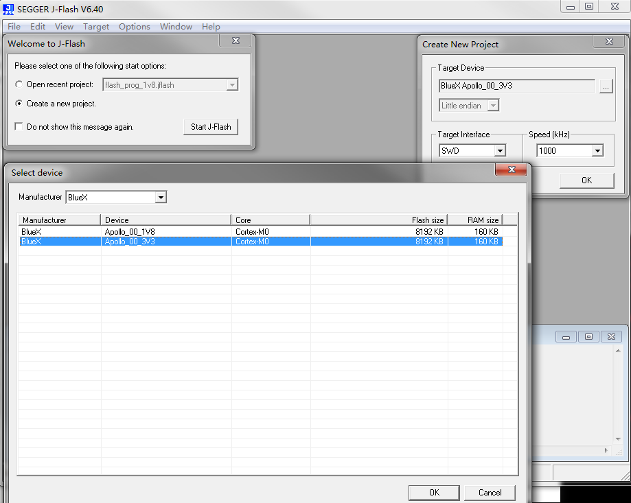

Debug configuration and Firmware download
===========================================

Prerequisite
--------------
Flash programming algorithm file should be copied to IDE and Debugger folders before trying to debug or download firmware.
Please following these steps:

#. Copy file [SDK Dir]/tools/prog_tool_v2/JLinkDevices.xml and folder [SDK Dir]/tools/prog_tool_v2/BlueX/ to folder [JLink Dir].
#. (For Keil Only)Copy files [SDK Dir]/tools/prog_tool_v2/BlueX/* to folder [Keil Dir]/ARM/Flash/.

Keil Configuration
--------------------
#. Power up the development board. Connect JLink to the board.
#. Open Keil project,Click Project->Options for Target '*'->Debug, select Use "J-LINK/J-TRACE Cortex". Deselect "Load Application at Startup".
#. Then click Settings->Flash Download. Select "Erase Sectors", "Program" and "Verify". Set "RAM for Algorithm Start: 0x100000, Size: 0x1000"
#. Click Add, Select "APOLLO_00_1V8" or "APOLLO_00_3V3" according to your Flash voltage. 
#. OK.

Eclipse Configuration
----------------------
#. Open Eclipse, import the project. Build a target. Click Run->Debug Configurations.
#. Double click GDB SEGGER J-Link Debugging to create a debug configuration.
#. In the page Main, click Search Project to select the elf file built just now.
#. In the page Debugger, set Device name to "APOLLO_00_1V8" or "APOLLO_00_3V3". Set Other options to "-singlerun -strict -timeout 0 -jlinkscriptfile JLinkSettings.JLinkScript".

    .. image:: eclipse_debug_configuration_1.png

#. In the page Startup, select "Initial Reset and Halt", "Enable flash breakpoints", "Load symbols: Use project binary", "Load executable: Use project binary", "Pre-run/Restart reset". Deselect "RAM application(reload after each reset/restart", "Set breakpoint at: main", "Continue".

    .. image:: eclipse_debug_configuration_2.png

#. Apply.

Firware download by J-Flash
-----------------------------
#. Open J-Flash. Create a new project.Select "BlueX Apollo_00_1V8" or "BlueX Apollo_00_3V3" as Target Device. Click OK.
#. Press F3 to Erase all Sectors or F4 to Erase Chip.
#. Open the hex file. Press F7 to automatically program and verify. 

