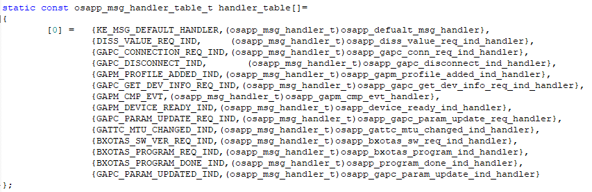

How to build the first BLE & peripheral application
^^^^^^^^^^^^^^^^^^^^^^^^^^^^^^^^^^^^^^^^^^^^^^^^^^^

BX2400 SDK面向用户提供了基于FreeRTOS的开发接口，在此基础上可以简单而快速的构建自己的第一个BLE/外设应用程序，而无须关心BLE和外设的实现细节。

构建第一个BLE应用程序
---------------------

1. 用户与协议栈交互原理

   基于FreeRTOS的软件体系，其核心为两个任务：BLE任务和APP任务。操作系统初始化时会有两个队列，BLE任务和APP任务通过这两个队列进行消息收发和处理。细节可以参考文档Folders structure & Software architecture.

#. 用户需要关注的核心：APP任务

   基于FreeRTOS，BX2400 SDK提供了简便易用的APP任务使用接口。用户需要做的事情绝大多数被抽象为一件事：定义并实现一个handler_table. 下面以osapp_dis_server为例详细描述：

