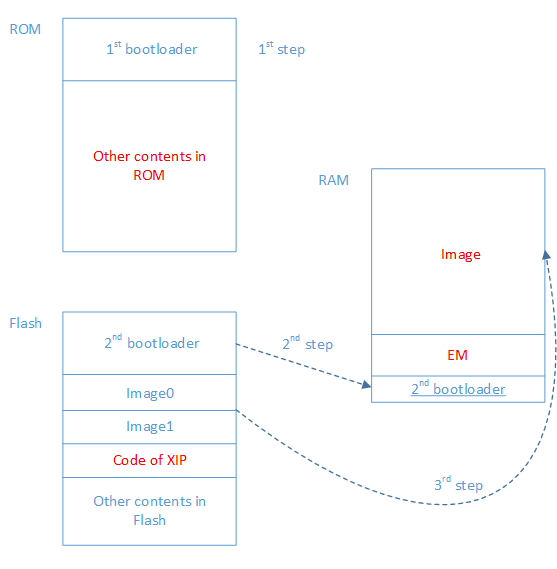

Memory Map
^^^^^^^^^^^^^^^^^^^^
BX2400的内存地址映射如下图所示：

BX2400的物理地址从0开始，依次包括ROM，RAM和Flash：

1. ROM
  
   ROM里包含启动代码，BLE协议栈，一些库代码，以及我们认为不会有更改的代码，例如BLE的核心调度。
  
#. General purpose RAM

   通用的RAM存放了所有的用户代码以及大部分数据，外加系统的代码和数据，例如FreeRTOS和通用的库函数的源代码。
  
#. Exchange Memory for BLE

	 按照协议栈和BLE硬件的实现需求，Exchange Memory(EM)为RAM中一块指定的区域，用户BLE硬件和软件交互参数和数据，其大小不超过10KB。这一部分用户不可用，但是EM之后剩余的20KB+用户可用。
  
#. Cache RAM

	 起始地址为0x130000的RAM为Cache，用于Flash XIP模式。在通常情况下，当用户程序都在RAM中运行的时候，Cache的功能不生效，因此这一部分RAM的起始4KB被用作NVDS，剩余的RAM用户也可以使用。
  
#. Flash Memory

   Flash Memory只有在Flash XIP模式下才会有系统总线编址，在RAM模式下Flash作为用户程序的存储区域，在系统启动时所有需要的内容都会被搬移到RAM中，之后只有在Flash操作时（比如NVDS读写）才会工作，其余大多数时候处于深睡眠状态。