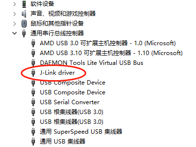

Running precompiled examples
^^^^^^^^^^^^^^^^^^^^^^^^^^^^

为了在能够快速验证开发板的功能，同时又尽量避免安装完整的工具链，可以通过将一些示例的可执行文件（*.bin）下载到Flash中，再从Flash启动运行进行验证。

将可执行文件下载到Flash中，通常有两种方法：量产模式下载和JFlash下载。前者是通过使用量产工具，经过串口将可执行文件下载到Flash中（参考量产工具使用指南）；后者是通过使用JLink工具包中的JFlash工具下载可执行文件到Flash中（参考JFlash烧写工具使用指南）。调试阶段，通常使用第二种方法。

下载前的准备工作：

1. 从Segger官网（https://www.segger.com/downloads/jlink/）下载最新的JLink安装文件

#. PC端插入JLink，可以在设备管理器中找到J-Link Driver，表示JLink已经安装成功。如下图所示：

之后通过JFlash下载bin文件到Flash：

1. 下载相应的可执行文件到本地目录

#. 将开发板通过JLink调试线与PC相连接。按照JFlash烧写工具使用指南，将可执行文件下载Flash中

#. 重新上电，从Flash中启动，运行可执行文件
        
根据具体的bin文件内容不同，重新运行后的开发板会有不同的执行结果。外设相关的APP需要查看相关的外设输出，BLE相关的APP需要查看空中数据。

