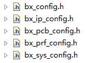

Top Layer header files configuration
^^^^^^^^^^^^^^^^^^^^^^^^^^^^^^^^^^^^^^^

用户在BX2400里开发应用程序，在开发之初需要在若干头文件中确定一些系统配置、外设配置以及应用配置，这些头文件在SDK的根目录下：

bx_config.h是一个总的头文件，包含了其他头文件：

..  code:: c

    #ifndef BX_CONFIG_H_
    #define BX_CONFIG_H_
    
    #include "bx_ip_config.h"
    #include "bx_prf_config.h"
    #include "bx_sys_config.h"
    #include "bx_pcb_config.h"
    #endif

-   bx_ip_config.h

    这个头文件中包含关于协议栈的配置定义，例如是否支持NVDS，BLE的角色定义，最大支持连接数等。由于这些宏的定义会直接影响ROM内容，因此用户不需要修改该头文件定义，也不需要关心其内容。

-   bx_pcb_config.h

    这个头文件中主要包含了IC的IO定义。BX2400的IO分为4个Pad组，每组的电压可以独立配置为1.8V/3.3V。用户需要根据自己的需求，将需要的外设配置到符合要求的IO Pad上。

    -   IO电压

        枚举常量VDD_1V8/VDD_3V分别表示IO Pad电压配置为1.8V和3.3V

    -   IO属性

        IO有若干属性，分别定义在枚举常量中：

        NORMAL_MODE_IE: 该IO在IC处于唤醒状态下时，需要打开IE(Input Enable)。IE是硬件的一个功能模块，使能后外部信号才能输入到IC中，因此该属性通常用于配置为输入的IO。

        SLEEP_MODE_IE: 该IO在IC处于睡眠状态下时，需要打开IE。这种配置通常用于外部中断唤醒的IO。

        UTILITY_IO_EN: 通用IO，无IE和retention等其他额外功能要求。

        SLEEP_RET_OUT_EN: 该IO在IC处于睡眠状态时需要维持睡前的状态。比较典型的例子，是IC充当SPI Master角色时，时钟线需要配置该属性。

        SLEEP_RET_OUT_H: 该IO在IC处于睡眠状态时需要维持高电平状态。比较典型的例子，是Uart的TX IO。

        其他IO，配置为GENERAL_PURPOSE_IO即可。

        在BX2400 SDK中，已经有一个默认的IO配置，用户只需要根据自己的需求去修改这个配置即可。

-   bx_prf_config.h

    该头文件里包含Profile的定义。用户可以根据自己的需求删减不需要的Profile，也可以增加自定义的Profile。

-   bx_sys_config.h

    该头文件里包含了系统相关的大多数配置，其中用户需要了解的有：

    -   CFG_HW_ECC

        表示使用硬件实现的ECC。考虑到BX2400内置CPU为Cortex-M0+，并不能执行复杂的算法运算，因此此选项通常需要打开。

    -   CFG_FREERTOS_SUPPORT

        表示在FREERTOS的框架下开发客户应用程序。

    -   CFG_SYS_LOG

        表示打开应用通过RTT打印信息的功能。在调试阶段该宏通常需要打开，在某些特殊状况下可以关闭以节省RAM(通常几个KB)。

    -   VBAT_MILLIVOLT

        表示用户程序运行时的IC供电电压。定义这个宏的原因是IO输出电压会和IC供电电压有关，系统需要根据供电电压对IO输出电压做调整。

    -   MAIN_CLOCK

        表示AHB时钟。必须为16000000的整数倍，最高96000000.

    -   BX_DEV_NAME

        表示调试阶段设备蓝牙名称。量产时IC是烧入Flash里的。

    -   BX_DEV_ADDR

        表示调试阶段设备蓝牙地址。和蓝牙名称一样，量产时IC是烧入Flash里的。
        
    -   DEEP_SLEEP_ENABLE

        表示用户程序是否可以进入低功耗睡眠模式。

    对于用户而言，这些是用户需要了解的配置选项，其他选项保持默认值即可。

