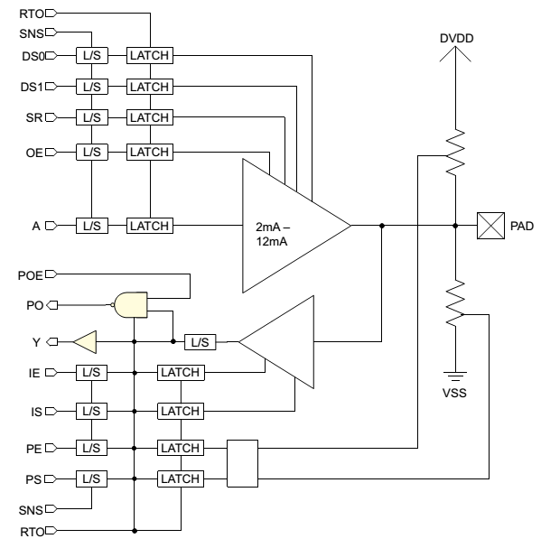
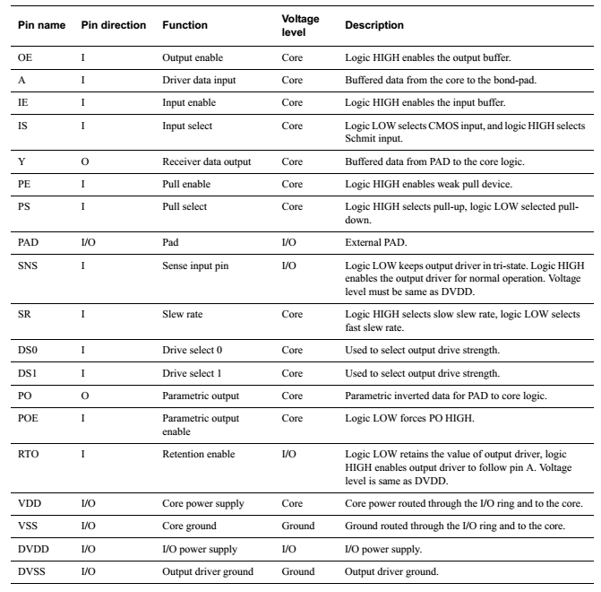

BX2400 IO and IO MUX
^^^^^^^^^^^^^^^^^^^^
PAD ring
--------
General description
>>>>>>>>>>>>>>>>>>>

BX2400 has 27 general GPIOs(P0 to P13, P15 to P17, P20 to P29. **Please note that P14, P18 and P19 do not exist!**), one IO for external reset and one IO for test mode. Each of the 30 GPIOS has multiple functions which are defined by the pin share logic. The IO pads for the general GPIOs are all bi-directional IO PADs and have many programmable features. The block diagram of the GPIOs is shown below:

The port description of the PAD cell is shown below:

The related registers are listed below:

================        ==========      ===================================================================================================
reg addr                reg name        reg description
0x2020104c[29:0]        o_gpio_ds0      controls the DS0 of the 30 GPIOs, bit 0 represents to DS0 of P0 and bit 29 represents to DS0 of P29
0x20201050[29:0]        o_gpio_ds1      controls the DS1 of the 30 GPIOs, bit 0 represents to DS1 of P0 and bit 29 represents to DS1 of P29
0x20201054[29:0]        o_gpio_ie       controls the IE of the 30 GPIOs, bit 0 represents to IE of P0 and bit 29 represents to IE of P29
0x20201058[29:0]        o_gpio_is       controls the IS of the 30 GPIOs, bit 0 represents to IS of P0 and bit 29 represents to IS of P29
0x2020105c[29:0]        o_gpio_pe       controls the PE of the 30 GPIOs, bit 0 represents to PE of P0 and bit 29 represents to PE of P29
0x20201060[29:0]        o_gpio_ps       controls the PS of the 30 GPIOs, bit 0 represents to PS of P0 and bit 29 represents to PS of P29
================        ==========      ===================================================================================================

IO power domain
>>>>>>>>>>>>>>>

The digital IOs are separated in 4 groups which can be programmed to different VDD. The first group includes P0, P1, P18, P19, P20, P21, P22, P23 and is powered by the internal power VDD_PAD0. The second group includes P2, P3, P4, P5, P6, P15, P16, P17 and is powered by the internal power VDD_PAD1. The third group includes P7, P8, P9, P10, P11, P12, P13, P14 and is powered by the internal power VDD_PAD2. The last group includes P24, P25, P26, P27, P28, P29 and is powered by the internal power VDD_PAD3. The voltage level of VDD_PAD* is controlled by the programmable register 0x20201074[16:13]. When the control bit is high, the corresponding VDD_PAD is programmed to be 3.3V. When the control bit is low, the corresponding VDD_PAD is programmed to be 1.8V.

IO MUX
------

The IO mux table of BX2400 is shown below:

+--------+--+---------------+---------------------------+-----------------------------------+-----------------------------+----------------------+
|pad name|IO|func0          |func1                      |func2                              |func3                        |func4                 |
|        |  +------------+--+----------+--+-------------+--------------+--+-----------------+-----------+--+--------------+-----------+--+-------+
|        |  |sig_name    |io|sig_name  |io|en           |sig_name      |io|en               |sig_name   |io|en            |sig_name   |io|en     |
+========+==+============+==+==========+==+=============+==============+==+=================+===========+==+==============+===========+==+=======+
|P24     |B |gpio[24]    |B |qspi_cs_n |O |qspi_en[0]   |              |  |                 |           |  |              |           |  |       |
+--------+--+------------+--+----------+--+-------------+--------------+--+-----------------+-----------+--+--------------+-----------+--+-------+
|P25     |B |gpio[25]    |B |qspi_clk  |O |qspi_en[0]   |              |  |                 |           |  |              |           |  |       |
+--------+--+------------+--+----------+--+-------------+--------------+--+-----------------+-----------+--+--------------+-----------+--+-------+
|P26     |B |gpio[26]    |B |qspi_dat0 |B |qspi_en[0]   |              |  |                 |           |  |              |           |  |       |
+--------+--+------------+--+----------+--+-------------+--------------+--+-----------------+-----------+--+--------------+-----------+--+-------+
|P27     |B |gpio[27]    |B |qspi_dat1 |B |qspi_en[1]   |              |  |                 |           |  |              |           |  |       |
+--------+--+------------+--+----------+--+-------------+--------------+--+-----------------+-----------+--+--------------+-----------+--+-------+
|P28     |B |gpio[28]    |B |qspi_dat2 |B |qspi_en[2]   |              |  |                 |           |  |              |           |  |       |
+--------+--+------------+--+----------+--+-------------+--------------+--+-----------------+-----------+--+--------------+-----------+--+-------+
|P29     |B |gpio[29]    |B |qspi_dat3 |B |qspi_en[3]   |              |  |                 |           |  |              |           |  |       |
+--------+--+------------+--+----------+--+-------------+--------------+--+-----------------+-----------+--+--------------+-----------+--+-------+
|P0      |B |swck        |I |gpio[0]   |B |gpio00_en    |              |  |                 |           |  |              |           |  |       |
+--------+--+------------+--+----------+--+-------------+--------------+--+-----------------+-----------+--+--------------+-----------+--+-------+
|P1      |B |swd         |B |gpio[1]   |B |gpio01_en    |              |  |                 |           |  |              |           |  |       |
+--------+--+------------+--+----------+--+-------------+--------------+--+-----------------+-----------+--+--------------+-----------+--+-------+
|P2      |B |gpio[2]     |B |spim0_cs1 |O |spim0_cs1_en |              |  |                 |func_io[0] |B |func_io_en[0] |           |  |       | 
+--------+--+------------+--+----------+--+-------------+--------------+--+-----------------+-----------+--+--------------+-----------+--+-------+
|P3      |B |gpio[3]     |B |spim0_cs0 |O |spim0_en     |spis_cs       |I |spis_en          |func_io[1] |B |func_io_en[1] |           |  |       | 
+--------+--+------------+--+----------+--+-------------+--------------+--+-----------------+-----------+--+--------------+-----------+--+-------+
|P4      |B |gpio[4]     |B |spim0_clk |O |spim0_en     |spis_clk      |I |spis_en          |func_io[2] |B |func_io_en[2] |           |  |       | 
+--------+--+------------+--+----------+--+-------------+--------------+--+-----------------+-----------+--+--------------+-----------+--+-------+
|P5      |B |gpio[5]     |B |spim0_miso|I |spim0_en     |spis_miso     |O |spis_en          |func_io[3] |B |func_io_en[3] |           |  |       | 
+--------+--+------------+--+----------+--+-------------+--------------+--+-----------------+-----------+--+--------------+-----------+--+-------+
|P6      |B |gpio[6]     |B |spim0_mosi|O |spim0_en     |spis_mosi     |I |spis_en          |func_io[4] |B |func_io_en[4] |           |  |       | 
+--------+--+------------+--+----------+--+-------------+--------------+--+-----------------+-----------+--+--------------+-----------+--+-------+
|P7      |B |gpio[7]     |B |spim1_cs1 |O |spim1_cs1_en |ble_mac_dbg[0]|O |ble_mac_dbg_en[0]|func_io[5] |B |func_io_en[5] |rfif_clk   |I |rfif_en|
+--------+--+------------+--+----------+--+-------------+--------------+--+-----------------+-----------+--+--------------+-----------+--+-------+
|P8      |B |gpio[8]     |B |spim1_cs0 |O |spim1_en     |ble_mac_dbg[1]|O |ble_mac_dbg_en[1]|func_io[6] |B |func_io_en[6] |rfif_rx[0] |O |rfif_en|
+--------+--+------------+--+----------+--+-------------+--------------+--+-----------------+-----------+--+--------------+-----------+--+-------+
|P9      |B |gpio[9]     |B |spim1_clk |O |spim1_en     |ble_mac_dbg[2]|O |ble_mac_dbg_en[2]|func_io[7] |B |func_io_en[7] |rfif_rx[1] |O |rfif_en|
+--------+--+------------+--+----------+--+-------------+--------------+--+-----------------+-----------+--+--------------+-----------+--+-------+
|P10     |B |gpio[10]    |B |spim1_miso|I |spim1_en     |ble_mac_dbg[3]|O |ble_mac_dbg_en[3]|func_io[8] |B |func_io_en[8] |rfif_tx[0] |I |rfif_en|
+--------+--+------------+--+----------+--+-------------+--------------+--+-----------------+-----------+--+--------------+-----------+--+-------+
|P11     |B |gpio[11]    |B |spim1_mosi|O |spim1_en     |ble_mac_dbg[4]|O |ble_mac_dbg_en[4]|func_io[9] |B |func_io_en[9] |rfif_tx[1] |I |rfif_en|
+--------+--+------------+--+----------+--+-------------+--------------+--+-----------------+-----------+--+--------------+-----------+--+-------+
|P12     |B |uart2ahb_txd|O |gpio[12]  |B |gpio14_en    |ble_mac_dbg[5]|O |ble_mac_dbg_en[5]|func_io[10]|B |func_io_en[10]|rfif_tx[2] |I |rfif_en|
+--------+--+------------+--+----------+--+-------------+--------------+--+-----------------+-----------+--+--------------+-----------+--+-------+
|P13     |B |uart2ahb_rxd|I |gpio[13]  |B |gpio15_en    |ble_mac_dbg[6]|O |ble_mac_dbg_en[6]|func_io[11]|B |func_io_en[11]|rfif_tx[3] |I |rfif_en|
+--------+--+------------+--+----------+--+-------------+--------------+--+-----------------+-----------+--+--------------+-----------+--+-------+
|P14     |B |gpio[14]    |B |          |  |             |ble_mac_dbg[7]|O |ble_mac_dbg_en[7]|func_io[12]|B |func_io_en[12]|rfif_tx[4] |I |rfif_en|
+--------+--+------------+--+----------+--+-------------+--------------+--+-----------------+-----------+--+--------------+-----------+--+-------+
|P15     |B |gpio[15]    |B |          |  |             |              |  |                 |func_io[13]|B |func_io_en[13]|rfif_tx[5] |I |rfif_en|
+--------+--+------------+--+----------+--+-------------+--------------+--+-----------------+-----------+--+--------------+-----------+--+-------+
|P16     |B |gpio[16]    |B |          |  |             |              |  |                 |func_io[14]|B |func_io_en[14]|           |          |
+--------+--+------------+--+----------+--+-------------+--------------+--+-----------------+-----------+--+--------------+-----------+--+-------+
|P17     |B |gpio[17]    |B |          |  |             |              |  |                 |func_io[15]|B |func_io_en[15]|rfif_tx[6] |I |rfif_en|
+--------+--+------------+--+----------+--+-------------+--------------+--+-----------------+-----------+--+--------------+-----------+--+-------+
|P18     |B |gpio[18]    |B |          |  |             |              |  |                 |func_io[16]|B |func_io_en[16]|rfif_tx[7] |I |rfif_en|
+--------+--+------------+--+----------+--+-------------+--------------+--+-----------------+-----------+--+--------------+-----------+--+-------+
|P19     |B |gpio[19]    |B |          |  |             |              |  |                 |func_io[17]|B |func_io_en[17]|rfif_tx[8] |I |rfif_en|
+--------+--+------------+--+----------+--+-------------+--------------+--+-----------------+-----------+--+--------------+-----------+--+-------+
|P20     |B |gpio[20]    |B |          |  |             |              |  |                 |func_io[18]|B |func_io_en[18]|rfif_tx[9] |I |rfif_en|
+--------+--+------------+--+----------+--+-------------+--------------+--+-----------------+-----------+--+--------------+-----------+--+-------+
|P21     |B |gpio[21]    |B |          |  |             |              |  |                 |func_io[19]|B |func_io_en[19]|rfif_tx[10]|I |rfif_en|
+--------+--+------------+--+----------+--+-------------+--------------+--+-----------------+-----------+--+--------------+-----------+--+-------+
|P22     |B |gpio[22]    |B |          |  |             |              |  |                 |func_io[20]|B |func_io_en[20]|rfif_tx[11]|I |rfif_en|
+--------+--+------------+--+----------+--+-------------+--------------+--+-----------------+-----------+--+--------------+-----------+--+-------+
|P23     |B |gpio[23]    |B |          |  |             |              |  |                 |func_io[21]|B |func_io_en[21]|           |  |       |
+--------+--+------------+--+----------+--+-------------+--------------+--+-----------------+-----------+--+--------------+-----------+--+-------+

The first column of the above table indicates the name of the IO of the chip. The digital IOs are separated in 4 groups which can be programmed to different VDD. The first group is marked with purple and is powered by the internal power VDD_PAD0. The second group is marked with blue and is powered by the internal power VDD_PAD1. The third group is marked with green and is powered by the internal power VDD_PAD2. The last group is marked with orange and is powered by the internal power VDD_PAD3. The voltage level of VDD_PAD* is controlled by the programmable register 0x20201074[16:13]. When the control bit is high, the corresponding VDD_PAD is programmed to be 3.3V. When the control bit is low, the corresponding VDD_PAD is programmed to be 1.8V.

The second column of the above table indicates the attribute of the IO. All of the IOs in the table are bidirectional IO.

The following columns are composed of 5 function groups which are named as fun0 to fun4. Each function group represents an optional function for the corresponding IO. Blank cells means no function. Each function group is composed of three column which are named as sig_name, io and en except the first function group which is composed of only two column which are named as sig_name and io. Column sig_name indicates the signal name for the corresponding IO when current function group is enabled. Column io indicates the direction for the corresponding IO when the current function group enabled. Column en indicates the enable signal name comes from the programmable control registers. The enable signal is high active and when the enable signal is set high, then the corresponding IO will act as the enabled function. There is only one of the enable signals in the same row can be high at the same time. And if all of the enable signals are low then the first function group is enabled for the corresponding IO.

The function group is illustrated below:

- Gpio[29:0] is the system general purpose IO function, the control module is the GPIO in the PER power domain.
- Swck and swd is the debug port of ARM cortex M0+ cpu.
- Uart2ahb_txd and uart2ahb_rxd is the system uart interface. The control module is the UART2AHB module in the CPU power domain.
- Qspi* is the four wire SPI interface, The control module is the QSPI in the CPU power domain.
- Spim0_* is the first SPI master interface. The control module is the SPIM0 in the PER power domain.
- Spim1_* is the second SPI master interface. The control module is the SPIM1 in the PER power domain.
- Ble_mac_dbg[7:0] is the debug port for BLE MAC and BLE modem. The control module is the BLE MAC and BLE modem in the BLE power domain.
- Rfif_* is the RF interface. The control module is the RF modules in the ANALOG power domain.
- Func_io[21:0] is the system programmable shared IO. The control module is the IO share logic.

The programmable registers for the enable signals are listed below:

================= ==============
address           reg name
0x20132020[23:16] ble_mac_dbg_en
0x20132020[13]    rfif_en
0x20132020[12]    gpio15_en
0x20132020[11]    gpio14_en
0x20132020[10]    gpio01_en
0x20132020[9]     gpio00_en
0x20132020[8]     spis_en
0x20132020[7]     spim1_cs1_en
0x20132020[6]     spim1_en
0x20132020[5]     spim0_cs1_en
0x20132020[4]     spim0_en
0x20132020[3:0]   qspi_en
0x20132024[21:0]  func_io_en
================= ==============

The func_io is shared by many interface modules and each bit of the func_io can be programmed to act as any of the shared function. The share table is listed below:

=========== == ===
signal name io idx
uart0_txd   O  0
uart0_rxd   I  1
uart0_cts   I  2
uart0_rts   O  3
uart1_txd   O  4
uart1_rxd   I  5
iic0_scl    B  6
iic0_sda    B  7
iic1_scl    B  8
iic1_sda    B  9
pwm0        O  10
pwm1        O  11
pwm2        O  12
pwm3        O  13
pwm4        O  14
=========== == ===

Column signal name indicates the signal name for the corresponding IO when current function is selected. The function in the above table is illustrated below:

- Uart0_* is the first uart interface. The control module is the UART0 in the PER power domain.
- Uart1_* is the second uart interface. The control module is the UART1 in the PER power domain.
- Iic0_* is the first iic interface. The control module is the IIC0 in the PER power domain.
- Iic1_* is the second iic interface. The control module is the IIC1 in the PER power domain.
- Pwm* is the pulse width modulation interface. The control module is the PWM in the PER power domain.

Column io indicates the direction for the corresponding IO when the current function is selected.

Column idx indicates the predefined index for the function. There is a programmable control register name as func_io*_sel for each of func_io. The function in the above table which index equals to the value of control register is selected for the func_io. The control registers are listed below:

=================  ==============
address            reg name
0x20132030[31:28]  func_io07_sel
0x20132030[27:24]  func_io06_sel
0x20132030[23:20]  func_io05_sel
0x20132030[19:16]  func_io04_sel
0x20132030[15:12]  func_io03_sel
0x20132030[11:8]   func_io02_sel
0x20132030[7:4]    func_io01_sel
0x20132030[3:0]    func_io00_sel
0x20132034[31:28]  func_io15_sel
0x20132034[27:24]  func_io14_sel
0x20132034[23:20]  func_io13_sel
0x20132034[19:16]  func_io12_sel
0x20132034[15:12]  func_io11_sel
0x20132034[11:8]   func_io10_sel
0x20132034[7:4]    func_io09_sel
0x20132034[3:0]    func_io08_sel
0x20132038[23:20]  func_io21_sel
0x20132038[19:16]  func_io20_sel
0x20132038[15:12]  func_io19_sel
0x20132038[11:8]   func_io18_sel
0x20132038[7:4]    func_io17_sel
0x20132038[3:0]    func_io16_sel
=================  ==============

Here is an example for the IO MUX logic. For GPIO P5, the io mux table is as below:

+--------+--+---------------+---------------------------+-----------------------------------+-----------------------------+----------------------+
|pad name|IO|func0          |func1                      |func2                              |func3                        |func4                 |
|        |  +------------+--+----------+--+-------------+--------------+--+-----------------+-----------+--+--------------+-----------+--+-------+
|        |  |sig_name    |io|sig_name  |io|en           |sig_name      |io|en               |sig_name   |io|en            |sig_name   |io|en     |
+========+==+============+==+==========+==+=============+==============+==+=================+===========+==+==============+===========+==+=======+
|P5      |B |gpio[5]     |B |spim0_miso|I |spim0_en     |spis_miso     |O |spis_en          |func_io[3] |B |func_io_en[3] |           |  |       | 
+--------+--+------------+--+----------+--+-------------+--------------+--+-----------------+-----------+--+--------------+-----------+--+-------+

If func_io_en[3] is set to high,
    then the P5 acts as the function io which final function is decided by register func_io05_sel. 
Else if spis_en is set to high,
    Then the P5 acts as MISO of the spi slave interface which is controlled by the SPIS module.
Else if spim0_en is set to high 
    Then the P5 acts as MISO of the spi master0 interface which is controlled by the SPIM0 module
Else 
    Then the P5 acts as GPIO which is controlled by the GPIO module.

If P5 acts as the function io, the function of P5 is decided by function io share table above and the value of control register func_io05_sel.

If func_io05_sel is set to 0,
	Then P5 acts as TXD of uart0 interface which is controlled by UART0 module
Else if func_io05_sel is set to 1,
    Then P5 acts as RXD of uart0 interface which is controlled by UART0 module 
Else if func_io05_sel is set to 2,
    Then P5 acts as CTS of uart0 interface which is controlled by UART0 module
.
.
.
.
Else if func_io05_sel is set to 13,
    Then P5 acts as PWM3 of PWM interface which is controlled by PWM module
Else if func_io05_sel is set to 14,
    Then P5 acts as PWM4 of PWM interface which is controlled by PWM module

