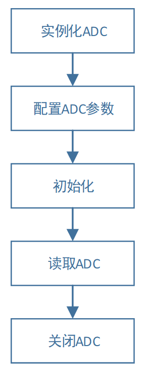

============
ADC控制器
============

    BX2400共有1个ADC转换器，具有6路复用通道，可以测量来自6路外模拟电压信号。

***************
【基本特性】
***************
ADC控制器的主要特性如下表所示：

- 转换精度可以达到10-bit。
- 支持进行DMA操作。
- 6路ADC数据采集，均为独立的模拟IO口，不占用数字IO口。
- 可以配置的LDO_DELAY时长。
- 超低功耗，100ksps时，典型电流值为5uA。
- 支持Battory Monitor和Touch。

***************
【ADC特性】 
***************

一、ADC的测量时间
=====================
ADC的测量时间如下述公式：

    **ADC 测量时间=LDO_DELAY+转换时间**

参数和含义如下表所示：

+-------------+-------------------------------------------------+
|参数         | 含义                                            |
+=============+=================================================+
|ADC 测量时间 |  从开始测量到测量测量结束，所耗费的时间。       |
+-------------+-------------------------------------------------+
|LDO_DELAY    |  ADC稳压器的持续时间，可以理解为采样时间。      |
+             +-------------------------------------------------+
|             |  此参数可以进行编程配置。                       |
+             +-------------------------------------------------+
|             |  如果设置LDO_FORCE_ON，则此时间为零。           |
+-------------+-------------------------------------------------+
|转换时间     |  ADC进行模拟-数字转换的时间                     |
+             +-------------------------------------------------+
|             |  在48MHz的情况下，转换时间为1.5us。             |
+-------------+-------------------------------------------------+

在进行LDO测量时候，需要首先开启LDO。在测量完毕之后，为了降低功耗，会把LDO关闭。
也可以将LDO配置为常开，这样就不需要LDO_DELAY这个时间，可以加快ADC测量速度。但是会造成功耗的增加。

LDO_DELAY时间=LDO_DELAY数值/ADC_CLK

二、ADC测量结果
=====================

ADC测量结果为10bit。测量结果和电压是呈线性关系。**量程为0-2.8V，对应输出为930-127。**

待测电压与ADC测量结果对应关系如下表所示：

+---+----+--------------------------------+
|Vin| ADC|                                |
+===+====+================================+
|0.0| 928|  .. image:: img/adc_val.png    |
+---+----+                                |
|0.1| 899|                                |
+---+----+                                |
|0.2| 873|                                |
+---+----+                                |
|0.3| 843|                                |
+---+----+                                |
|0.4| 814|                                |
+---+----+                                |
|0.5| 784|                                |
+---+----+                                |
|0.6| 757|                                |
+---+----+                                |
|0.7| 728|                                |
+---+----+                                |
|0.8| 699|                                |
+---+----+                                |
|0.9| 672|                                |
+---+----+                                |
|1.0| 643|                                |
+---+----+                                |
|1.1| 616|                                |
+---+----+                                |
|1.2| 588|                                |
+---+----+                                |
|1.3| 561|                                |
+---+----+                                |
|1.4| 533|                                |
+---+----+                                |
|1.5| 495|                                |
+---+----+                                |
|1.6| 468|                                |
+---+----+                                |
|1.7| 443|                                |
+---+----+                                |
|1.8| 418|                                |
+---+----+                                |
|1.9| 389|                                |
+---+----+                                |
|2.0| 360|                                |
+---+----+                                |
|2.1| 330|                                |
+---+----+                                |
|2.2| 303|                                |
+---+----+                                |
|2.3| 274|                                |
+---+----+                                |
|2.4| 248|                                |
+---+----+                                |
|2.5| 221|                                |
+---+----+                                |
|2.6| 192|                                |
+---+----+                                |
|2.7| 159|                                |
+---+----+                                |
|2.8| 127|                                |
+---+----+--------------------------------+

***************
【程序操作】
***************

程序操作流程如下图所示：

第一步：实例化ADC。
=============================

.. code:: c

    app_adc_inst_t adc = ADC_INSTANCE(0);

第二步：配置传输参数。
==============================

传输参数结构体定义如下所示：

.. code:: c

    typedef struct
    {
        uint16_t  ldo_delay_us;
        uint8_t   ldo_force_on;
        uint8_t   use_dma;
        uint16_t  dma_size;
        uint16_t* dma_bufptr;
        uint16_t  dma_delay;
    }app_adc_comm_params_t;

其中的成员的参数含义以及取值，如下表所示：

+--------------+----------------------+---------------------------------------------------------------------------+
|参数          |   取值               |  含义                                                                     |
+==============+======================+===========================================================================+
|ldo_delay_us  |     0x0000-0xFFFF    |  LDO延时的时间，单位为us。                                                |
+              |                      +---------------------------------------------------------------------------+
|              |                      |  配置次该参数，决定了LDO_DELAY的大小。                                    |
+              |                      +---------------------------------------------------------------------------+
|              |                      |  系统会根据系统时钟的频率，来计算出LDO_DELAY的值。                        |
+--------------+----------------------+---------------------------------------------------------------------------+
|ldo_force_on  |     0或1             |  0：ldo_delay_us生效。                                                    |
+              |                      +---------------------------------------------------------------------------+
|              |                      |  1：ldo_delay_us参数失效，始终开启LDO，会增加功耗。但是会加快ADC采集速度。|
+--------------+----------------------+---------------------------------------------------------------------------+
|use_dma       |     0或1             |  0：关闭DMA功能。                                                         |
+              |                      +---------------------------------------------------------------------------+
|              |                      |  1：开启DMA功能。                                                         |
+--------------+----------------------+---------------------------------------------------------------------------+
|dma_size      |                      |  DMA一次性采集多少次数据。                                                |
+              |                      +---------------------------------------------------------------------------+
|              |                      |  如果use_dma=0，则忽略本参数。                                            |
+--------------+----------------------+---------------------------------------------------------------------------+
|dma_bufptr    |                      |  DMA传输的缓冲区，用来存放采集到的ADC数值。                               |
+              |                      +---------------------------------------------------------------------------+
|              |                      |  如果use_dma=0，则忽略本参数。                                            |
+--------------+----------------------+---------------------------------------------------------------------------+
|dma_delay     |     0x0000-0xFFFF    |  两次DMA采集之间的延时，单位为系统时钟频率。                              |
+              |                      +---------------------------------------------------------------------------+
|              |                      |  如果use_dma=0，则忽略本参数。                                            |
+--------------+----------------------+---------------------------------------------------------------------------+

第三步：初始化。
==============================

设置完参数之后，需要进行初始化操作，让参数生效，并且开启IIC。
函数原型：

.. code:: c

    void app_adc_init(periph_inst_handle_t hdl)

函数使用：

.. code:: c

    app_adc_init(adc0.inst);

初始化的过程，会开启ADC模块，并开启对应的中断系统，以及时钟模块。

第四步：读取ADC操作。
==============================

不使用DMA的读取ADC操作函数原型如下：
------------------------------------------------------

.. code:: c

    uint16_t app_adc_read_without_dma(periph_inst_handle_t hdl , 
                                      uint8_t channel)

此函数为阻塞函数，在没有读取完毕的时候，会一直卡在函数内部。只有等待读取完毕，参会退出函数，返回结果。

其参数和返回值的含义如下表所示：

========     ===============================================
参数          含义
========     ===============================================
hdl             ADC实例的句柄。
channel         需要选择哪一个通道。取值范围为0-5。
返回值         返回读取的ADC的结果。
========     ===============================================

使用DMA的读取ADC操作函数原型如下：
------------------------------------------------------

.. code:: c

    void app_adc_read_with_dma( periph_inst_handle_t hdl , 
                                uint8_t channel , 
                                void (*callback) (void*,uint8_t),
                                void* dummy)

此函数为非阻塞函数，在配置完内部寄存器之后，会退出此函数。等到ADC采集完毕，会调用回调函数来进行通知。

其参数的含义如下表所示：

=========    ==============================================
参数          含义
=========    ==============================================
hdl           ADC实例的句柄。
channel       需要选择哪一个通道。取值范围为0-5。
callback      读取完毕的回调函数。
dummy         回调函数的参数。
=========    ==============================================

第五步：关闭ADC。
==============================

在使用完毕ADC的时候，或者更改ADC参数的需要重新运行的时候，需要进行关闭ADC的操作。

函数原型：

.. code:: c

    void app_adc_uninit(periph_inst_handle_t hdl);

函数使用：

.. code:: c

    app_adc_uninit(adc0.inst);

关闭的过程，会关闭ADC模块，并关闭对应的中断系统，以及时钟模块。

