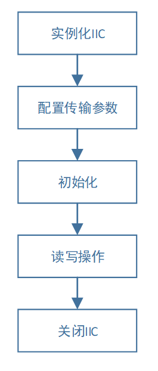
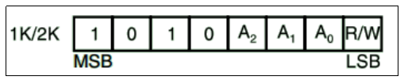
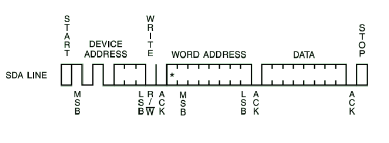
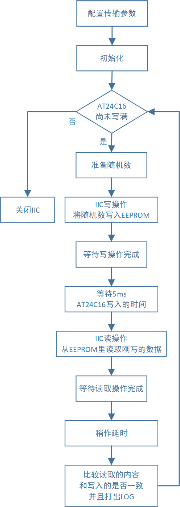
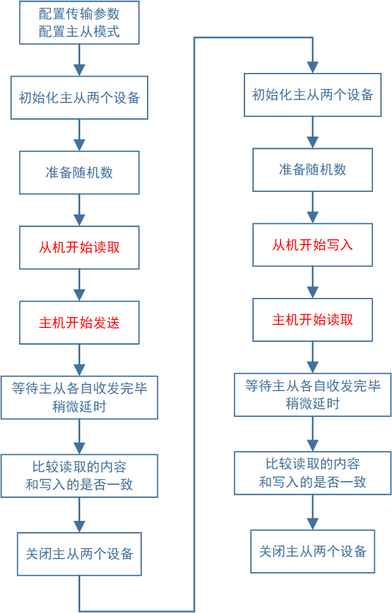

============
IIC控制器
============

    IIC可以在MCU和MCU或者MCU和外设之间进行通信。可以同时连接多个slave设备实现多机并联通信。可以启用DMA功能减小CPU的负担。

***************
【基本特性】
***************

IIC控制器的主要特性如下表所示：

- 一共有两个IIC控制器，每一个都可以单独配置
- 可以配置为slave模式，或者master模式。
- 支持100kHz、400kHz、1MHz三种SCL频率。
- 支持DMA读写操作。
- 支持7bit或10bit器件地址。
- 支持0bit、8bit、16bit内存地址读取。
- 自带16Byte发送接收FIFO，可减小CPU负担。

***************
【程序操作】
***************

程序操作流程如下图所示：

第一步：实例化IIC。
======================

.. code:: c

    app_iic_inst_t iic0 = IIC_INSTANCE(0);
    app_iic_inst_t iic1 = IIC_INSTANCE(1);

如果使用IIC外设，必须首先声明IIC实例，然后才可以对实例进行操作。

其中“IIC_INSTANCE”宏定义可以进行IIC实例的声明，其中的参数为IIC控制器序号，数值为0-2。

如需同时使用多个PWM通道，则需要同时声明多个实例。上述代码声明了2个IIC实例，可以同时输出2路IIC信号。

第二步：配置传输参数。
======================

数据结构
-------------------------

	传输参数结构体定义如下所示：

.. code:: c

    /**@brief IIC communication structure holding configuration settings for the peripheral.
    */
    typedef struct
    {
        app_iic_address_bit_num_t   dev_addr_bit_num;   /** device address length. */
        app_iic_mem_addr_num_t      mem_addr_bit_num;   /** memory address length. */
        app_iic_work_mode_t         work_mode;          /** work mode is slave or master.  */
        app_iic_speed_mode_t        speed_mode;         /** SCL clock speed switch.  */
        uint16_t                    slave_address;      /** Slave Address only in SLAVE MODE  */
    
        uint8_t sda_pin;                                /** SDA pin number, range from 2 to 23.  */
        uint8_t scl_pin;                                /** SCL pin number, range from 2 to 23.  */
        uint8_t enable_pull_up;                         /** if SDA and SCL enable internal pull-up resistor.  */
        uint8_t use_dma;                                /** use DMA = 1 , donnot use DMA = 0 */
    }app_iic_comm_params_t;

参数含义
---------------------

其中的成员的参数含义以及取值，如下表所示:

+-------------------+-----------------------------+--------------------------------------------------------------------------------------------------------+
|参数               |    取值                     |  含义                                                                                                  |
+===================+=============================+========================================================================================================+
|dev_addr_bit_num   |    IIC_7BIT_ADDRESS         |  器件设备地址具有7bit                                                                                  |
+                   +-----------------------------+--------------------------------------------------------------------------------------------------------+
|                   |    IIC_10BIT_ADDRESS        |  器件设备地址具有10bit                                                                                 |
+-------------------+-----------------------------+--------------------------------------------------------------------------------------------------------+
|mem_addr_bit_num   |    IIC_NO_MEMORY_ADDRESS    |  没有器件内存地址。即IIC普通对传。                                                                     |
+                   +-----------------------------+--------------------------------------------------------------------------------------------------------+
|                   |    IIC_8BIT_MEMORY_ADDRESS  |  8bit器件内存地址。即某些传感器的数据在指定地址存放，其地址为8bit                                      |
+                   +-----------------------------+--------------------------------------------------------------------------------------------------------+
|                   |    IIC_16BIT_MEMORY_ADDRESS |  16bit器件内存地址。即某些传感器的数据在指定地址存放，其地址为16bit                                    |
+-------------------+-----------------------------+--------------------------------------------------------------------------------------------------------+
|work_mode          |    IIC_SLAVE                |  工作模式：系统工作在slave从模式                                                                       |
+                   +-----------------------------+--------------------------------------------------------------------------------------------------------+
|                   |    IIC_MASTER               |  工作模式：系统工作在master主模式                                                                      |
+-------------------+-----------------------------+--------------------------------------------------------------------------------------------------------+
|speed_mode         |    IIC_STANDARD_MODE        |  标准速度：SCL速度100kHz                                                                               |
+                   +-----------------------------+--------------------------------------------------------------------------------------------------------+
|                   |    IIC_FAST_MODE            |  快速模式：SCL速度400kHz                                                                               |
+                   +-----------------------------+--------------------------------------------------------------------------------------------------------+
|                   |    IIC_HIGH_SPEED_MODE      |  高速模式：SCL速度1000kHz，在此模式下，系统会自动先发送一个总线识别码。不可取消。                      |
+-------------------+-----------------------------+--------------------------------------------------------------------------------------------------------+
|slave_address      |    0x0000 – 0x3FF           |  设备的地址。仅仅作为slave模式下有效。地址不包含最低位的RW位。在master模式下，可以不关心此成员。       |
+-------------------+-----------------------------+--------------------------------------------------------------------------------------------------------+
|sda_pin            |    2-23                     |  IIC的SDA脚选择                                                                                        |
+-------------------+-----------------------------+--------------------------------------------------------------------------------------------------------+
|scl_pin            |    2-23                     |  IIC的SCL脚选择                                                                                        |
+-------------------+-----------------------------+--------------------------------------------------------------------------------------------------------+
|enable_pull_up     |    0或1                     |   0：不启用内部自带的上拉功能，必须外加上拉电阻。                                                      |
+                   +                             +--------------------------------------------------------------------------------------------------------+
|                   |                             |   1：启用内部自带的上拉功能，可以不用外加上拉电阻。                                                    |
+-------------------+-----------------------------+--------------------------------------------------------------------------------------------------------+
|use_dma            |    0或1                     |   含义：是否启用DMA传输。在读取或写入操作时候，系统会根据此参数，来决定是否使用DMA。                   |
+                   +                             +--------------------------------------------------------------------------------------------------------+
|                   |                             |  其中从模式（slave）暂不支持DMA传输。0：不启用DMA传输。1：启用DMA传输。                                |
+-------------------+-----------------------------+--------------------------------------------------------------------------------------------------------+

第三步：初始化。
=========================

	设置完参数之后，需要进行初始化操作，让参数生效，并且开启IIC。

函数原型：

.. code:: c

    void app_iic_init  (periph_inst_handle_t hdl);

函数使用：

.. code:: c

    app_iic_init(&iic0.inst);

初始化的过程，会开启IIC模块，并开启对应的中断系统，以及时钟模块。

第四步：读写操作。
======================

读写接口
-------------------------

读写操作分为读操作和写操作。

**读写操作函数原型如下：**

.. code:: c

    void app_iic_read (periph_inst_handle_t hdl,
                        uint8_t *bufptr, 
                        uint32_t size, 
                        uint16_t device_address, 
                        uint16_t mem_address , 
                        void (*callback) (void*,uint8_t),
                        void* dummy);

    void app_iic_write(periph_inst_handle_t hdl,
                       uint8_t *bufptr, 
                       uint32_t size, 
                       uint16_t device_address, 
                       uint16_t mem_address , 
                       void (*callback) (void*,uint8_t),
                       void* dummy);

其中读写的函数比较类似，参数的内容和含义是完全相同的。

读操作和写操作在底层又分为：DMA操作和不带DMA操作。

但是对于用户的接口仍然只有上述的两个函数，用户只需要配置第二步中的use_dma参数，在底层即可自动切换是否启用DMA，而无需用户的额外操作。

参数含义
-------------------------

**函数的参数含义如下表所示：**

==================      ===============================================================================================
参数                     含义
==================      ===============================================================================================
hdl                      IIC模块实例的句柄，表明了使用哪一个IIC进行操作。
bufptr                   需要发送/接收的数据的指针。
size                     需要发送/接收的数据的长度。
device_address           | 目标设备的器件地址。该地址为8bit，包含最低位的RW标志。 
                         | 例如:参数为0xA0，那么在写操作系统会发送0xA0，读操作系统会发送0xA1
mem_address              | 要读取的目标设备的的内存地址。该数据会紧接着器件地址之后发送。
                         | 如果不需要发送mem_address，那么需要在第二步的mem_addr_bit_num设置为IIC_NO_MEMORY_ADDRESS，
                         | 然后本参数可以不做处理。
callback                 发送完成的回调函数
dummy                    发送完成的回调函数的参数
==================      ===============================================================================================

第五步：关闭IIC。
======================

在使用完毕IIC的时候，或者更改IIC参数的需要重新运行的时候，需要进行关闭IIC的操作。

函数原型：

.. code:: c

    void app_iic_uninit  (periph_inst_handle_t hdl);

函数使用：

.. code:: c

    app_iic_uninit(&iic0.inst);

关闭的过程，会关闭IIC模块，并关闭对应的中断系统，以及时钟模块。

************************
【注意事项与说明】
************************

关于device_address和mem_address的理解，以AT24C02芯片为例：

（1）device_address说明
============================

AT24C02芯片采用A2、A1、A0三个引脚的电平来控制device address。如下图所示：

当A2、A1、A0三个脚均接地，那么该器件的写地址为0xA0，读地址为0xA1。上述函数中的device_address应该填写0xA0。而非0x50。

（2）memory address说明
============================

在发送完device_address，会再发送memory address的内容，之后再发送bufptr的内容。

当第二步的mem_addr_bit_num参数不同，发送的内容也不同。

**如下表所示**

===========================      ===========================================================
mem_addr_bit_num参数内容            | 发送数据内容
===========================      ===========================================================
IIC_NO_MEMORY_ADDRESS               | 发送完毕device_address之后，立即发送bufptr的内容
IIC_8BIT_MEMORY_ADDRESS             | 发送完毕device_address之后，
                                    | 再发送1字节的memory address，然后再发送bufptr的内容
IIC_16BIT_MEMORY_ADDRESS            | 发送完毕device_address之后，
                                    | 再发送2字节的memory address，然后再发送bufptr的内容
===========================      ===========================================================

（3）memory address类型介绍
================================

	下面以AT24C02和AT24C1024B为实例介绍。

1、8bit的memory address
------------------------------------

AT24C02芯片对指定地址写入一个字节的操作，如下图所示;

其中图中的WORD ADDRESS就是函数参数中的mem_address。

在发送完成device address之后，紧接着发送一个字节word address，来确定写入EEPROM中的哪一个地址中的数据。后面紧跟着的内容就是需要写入的数据内容。

2、16bit的memory address
------------------------------------

AT24C1024芯片对指定地址写入一个字节的操作，如下图所示;

.. image:: img/iic_write_byte_16.png

其中图中的WORD ADDRESS就是函数参数中的mem_address。由于AT24C1024的内存比较大，需要更大的寻址空间，所以需要2字节的内存地址。

在发送完成device address之后，紧接着发送两个字节的word address，来确定写入EEPROM中的哪一个地址中的数据。后面紧跟着的内容就是需要写入的数据内容。

3、no memory address
------------------------------------

如果对IIC进行操作的对象，不是存储芯片或者传感器，就没有上述的memory address。可以选择mem_addr_bit_num参数为IIC_NO_MEMORY_ADDRESS。这样在发送的时候，就不会发送memory address这部分的内容。

（4）收发数据注意事项
================================

- bufptr所指向的内存，务必要预留足够大的空间，用来存放发送、接受的数据内容。
- 如果使用DMA发送或接受，如果参数size的长度超过32，需要在“app_iic.h”中的宏定义中，增大APP_IIC_DMA_TXRX_BUFFER参值至少为size的大小。

.. code:: c

    #define APP_IIC_DMA_TXRX_BUFFER     32

************
【样例程序】
************

参考“app_iic_test.c”

主模式测试
====================

程序与流程
-------------------------

.. code:: c

    void app_iic_master_test(void)
    
    uint8_t app_iic_eeprom_test(app_iic_inst_t *handle , 
                                uint8_t use_dma , 
                                uint8_t speed_mode)

app_iic_eeprom_test函数为EEPROM测试读写函数。该函数内部流程如下图所示：

参数含义
-------------------------

其参数含义如下表所示：

=========================     ====================================================
参数                              |  含义
=========================     ====================================================
app_iic_inst_t \*handle           |  选择使用哪一个IIC实例进行操作。
uint8_t use_dma                   |  选择是否启用DMA操作
                                  |  0：不启用DMA
                                  |  1：启用DMA
uint8_t speed_mode                |  选择速度模式。
                                  |  1：低速模式（100kHz），同IIC_STANDARD_MODE
                                  |  2：全速模式（400kHz），同IIC_FAST_MODE
                                  |  3：高速模式（1MHz），同IIC_HIGH_SPEED_MODE
=========================     ====================================================

其中app_iic_master_test函数会循环调用app_iic_eeprom_test函数。每一次调用的时候，会分别启用不同的速度模式，以及不同的DMA模式。并且会分别选择使用IIC0还是IIC1进行测试。

从模式测试
====================

程序与流程
-------------------------

.. code:: c

    void app_iic_slave_test(void)
    
    uint32_t app_iic_slave_module_test(app_iic_inst_t *hdl_master , 
                                    app_iic_inst_t *hdl_slave , 
                                    uint8_t speed_mode)

其中app_iic_slave_module_test函数为IIC0和IIC1，一个作为主模式，一个作为从模式，两者相互对传的测试读写函数。该函数内部流程如下图所示：

参数含义
-------------------------

其参数含义如下表所示：

=============================    ====================================================
参数                              | 含义
=============================    ====================================================
app_iic_inst_t \*hdl_master       | 主设备的实例的句柄
app_iic_inst_t \*hdl_master       | 从设备的实例的句柄
uint8_t speed_mode                | 选择速度模式。
                                  | 1：低速模式（100kHz），同IIC_STANDARD_MODE
                                  | 2：全速模式（400kHz），同IIC_FAST_MODE
                                  | 3：高速模式（1MHz），同IIC_HIGH_SPEED_MODE
=============================    ====================================================

其中app_iic_slave_test函数会循环调用app_iic_slave_module_test函数。每一次调用的时候，会分别启用不同的速度模式。并且会分别选择使用IIC0作为slave还是IIC1作为slave进行测试。

