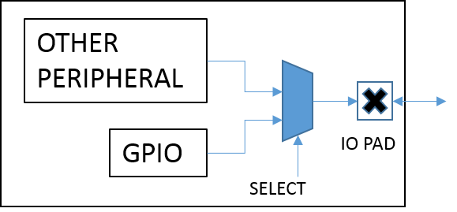


IO_CTRL
=======

在BX2400系统中，IO的控制由内部的pin_share逻辑控制，若某IO被映射为外设的管脚，则该IO动作受外设模块逻辑控制；若未被映射为外设管脚，则IO动作受GPIO模块控制，关系如下图所示。

该文档讲解作为GPIO时的IO使用。

使用
"""""""

#. IO初始化

    .. code:: c

        #include "io_ctrl.h"   
        io_init();
    
    BX2400系统已经自动执行过上述初始化，用户无需再次初始化。
    

#. 设置IO输入、输出方向

    .. code:: c
    
        void io_dir_write_all(uint32_t dir);
        void io_dir_output_set(uint32_t output_mask);
        void io_dir_input_set(uint32_t input_mask);
        void io_cfg_output(uint8_t pin_num);
        void io_cfg_input(uint8_t pin_num);
        void io_pin_dir_set(uint8_t pin_num,uint8_t dir);
        
    .. note::
    
        读取输入电平或设置输出电平前，务必先设置IO输入输出方向，否则IO处于无效状态，无法得到正确的结果。
        
        建议仅仅配置必须使用的IO方向，不建议使用io_dir_write_all()函数。io_dir_write_all()函数会将所有IO均设为有效状态，若未使用到的IO处在浮空状态，会芯片增大漏电。
        
        
#. 输出：设置输出电平、读取输出电平

    .. code:: c
    
        void io_write_all(uint32_t val);
        uint32_t io_out_read_all(void);
        void io_pin_write(uint8_t pin_num,uint8_t val);
        uint8_t io_pin_out_read(uint8_t pin_num);
        void io_pin_set(uint8_t pin_num);
        void io_pin_clear(uint8_t pin_num);
        void io_pin_toggle(uint8_t pin_num);
    
    
#. 输入:读取输入电平

    .. code:: c
    
        uint32_t io_read_all(void);
        uint8_t io_pin_read(uint8_t pin_num);

#. IO上、下拉

    .. code:: c
    
        typedef enum 
        {
            IO_PULL_DISABLE,
            IO_PULL_UP,
            IO_PULL_DOWN,    
        }io_pull_type_t;
        void io_pin_pull_write(uint8_t pin_num,io_pull_type_t pull);
        io_pull_type_t io_pin_pull_read(uint8_t pin_num);

#. IO外部中断配置、使能

    .. code:: c
    
        typedef enum 
        {
            EXT_INT_TRIGGER_HIGH_LEVEL, 
            EXT_INT_TRIGGER_LOW_LEVEL,  
            EXT_INT_TRIGGER_POS_EDGE,   
            EXT_INT_TRIGGER_NEG_EDGE,    
        }ext_int_mode_t;
        void io_ext_int_cfg(uint8_t pin_num,ext_int_mode_t mode,void (*callback)());
        void io_ext_int_en(uint8_t pin_num,bool enable);
    
        
    
详细API介绍参见SDK目录plf/bx2400/src/sys_integration/sysctrl/io_ctrl.h
