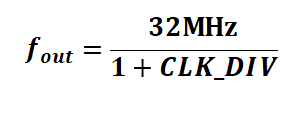
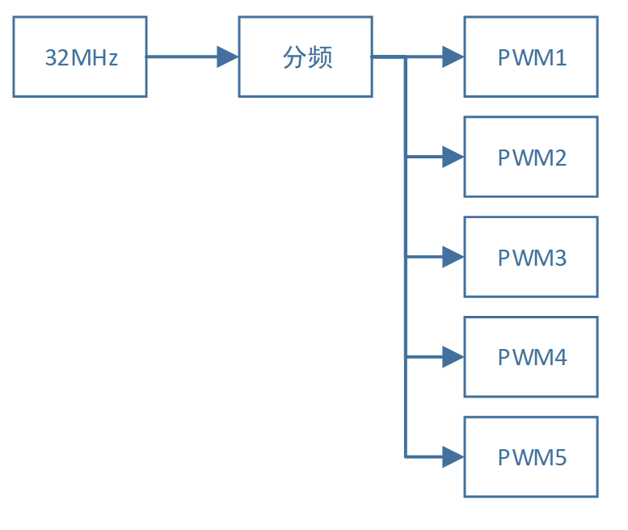
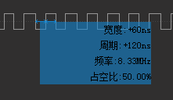
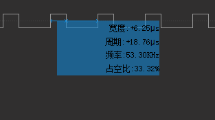
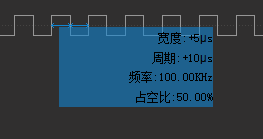
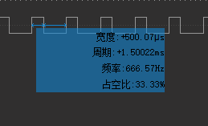

============
PWM控制器
============

    PWM控制器一共可以输出5路不同的PWM信号，每一路的高电平持续时间、低电平持续时间都可以分别独立进行配置。PWM控制器的时钟源频率也可以进行配置。

***************
【基本特性】
***************

PWM控制器的主要特性如下表所示：

- PWM控制器时钟源最高可达16MHz，时钟源频率可以进行配置。
- 每个PWM通道相互独立，可以分别配置高低电平持续时间。
- 5路输出，每一路PWM对应的IO口可以进行配置。

***************
【时钟结构】
***************

PWM时钟由系统32MHz时钟生成，经过可配置的分频器之后，送往各路PWM输出。

分频参数CLK_DIV可以进行配置，CLK_DIV取值范围为0x00-0xFF，当CLK_DIV>0的时候，分频输出频率如下公式所示：

PWM 的时钟结构如图所示：

***************
【程序设计】
***************

第一步：设置分频参数
=============================

分频参数和PWM通道无关，改变分频参数会改变所有PWM通道。

所以不在每个通道的参数设置，而是在宏定义中进行设置。在“app_pwm.h”中，定义了分频参数以及数据结构。

.. code:: c

    #define ALL_CHANNEL_PWM_CLK_DIV     1

其中“ALL_CHANNEL_PWM_CLK_DIV”即CLK_DIV分频数值，取值范围是0x00-0xFF。参数取值与分频数值如下表所示：

==============================      =======================================
ALL_CHANNEL_PWM_CLK_DIV取值             分频
==============================      =======================================
0                                       1/2
0x01-0xFF                               1/(1+ ALL_CHANNEL_PWM_CLK_DIV)
==============================      =======================================

第二步：实例化PWM对象
==============================

.. code:: c

    app_pwm_inst_t pwm0 = PWM_INSTANCE(0);
    app_pwm_inst_t pwm1 = PWM_INSTANCE(1);
    app_pwm_inst_t pwm2 = PWM_INSTANCE(2);
    app_pwm_inst_t pwm3 = PWM_INSTANCE(3);
    app_pwm_inst_t pwm4 = PWM_INSTANCE(4);

如果使用PWM外设，必须首先声明PWM实例，然后才可以对实例进行操作。

其中“PWM_INSTANCE”宏定义可以进行PWM实例的声明，其中的参数为PWM控制器序号，数值为0-4。

如需同时使用多个PWM通道，则需要同时声明多个实例。上述代码声明了5个PWM实例，可以同时输出5路PWM信号。

第三步：设置PWM实例参数，并初始化
====================================

.. code:: c

    pwm0.param.pin_num   = 8;
    pwm0.param.high_time = 100;
    pwm0.param.low_time  = 100;
    app_pwm_init(&pwm0.inst);

PWM实例的参数在param成员中，共有3个参数，参数含义如下表所示：

=============    ==================================================
参数               含义
=============    ==================================================
pin_num            管脚序号
high_time          高电平持续时间，以分频之后的频率来计数。
low_time           低电平持续时间，以分频之后的频率来计数。
=============    ==================================================

设置完毕参数之后，采用app_pwm_init函数来进行初始化。

第四步：开启或关闭输出：
==============================

.. code:: c

    app_pwm_start(&pwm0.inst);
    app_pwm_stop (&pwm0.inst);

===============    =======================================================
函数                | 含义
===============    =======================================================
app_pwm_start       | 开启PWM输出。
                    | 此操作会重新读取param成员中的参数然后输出。
app_pwm_stop        | 关闭PWM输出。
                    | 此操作会关闭PWM模块，同时将IO口输出为低电平。
===============    =======================================================

*********************
【实例配置与效果】
*********************

配置1：
=======

===================================    =========
参数                                    取值
===================================    =========
ALL_CHANNEL_PWM_CLK_DIV                 1
high_time                               0
low_time                                0
波形

===================================    =========

配置2：
=======

===================================    =========
参数                                    取值
===================================    =========
ALL_CHANNEL_PWM_CLK_DIV                 1
high_time                               99
low_time                                199
波形

===================================    =========

配置3：
=======

===================================    =========
参数                                    取值
===================================    =========
ALL_CHANNEL_PWM_CLK_DIV                 15
high_time                               9
low_time                                9
波形

===================================    =========

配置4：
=======

===================================    =========
参数                                    取值
===================================    =========
ALL_CHANNEL_PWM_CLK_DIV                 15
high_time                               999
low_time                                1999
波形

===================================    =========

