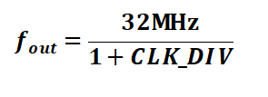
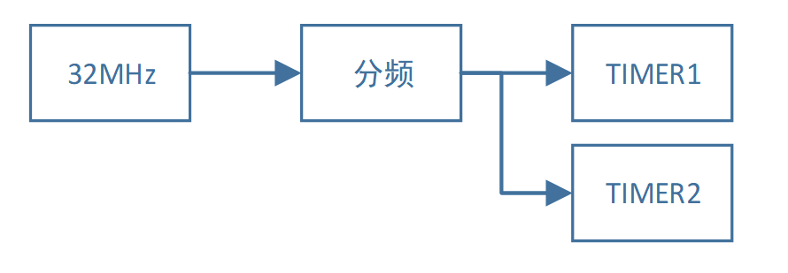
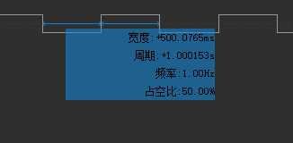
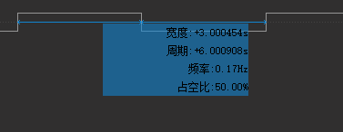
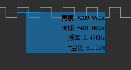
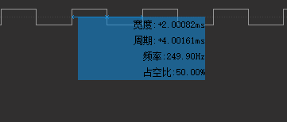

============
TIMER控制器
============

    BX2400具有2个独立的定时器。每个定时器均为24bit向下计数。在计数器数值降低为零的时候会产生中断。并且自动重装载计数器数值。

***************
【基本特性】
***************

TIMER控制器的主要特性如下表所示：

- TIMER控制器时钟源最高可达16MHz，时钟源频率可以进行配置。
- 每个TIMER通道相互独立，可以分别配置自动装填数值。
- 24bit向下计数，计数器归零之后自动重装填。
- 计数器为零是会产生中断请求。 

***************
【时钟结构】
***************

PWM时钟由系统32MHz时钟生成，经过可配置的分频器之后，送往各路TIMER。

分频参数CLK_DIV可以进行配置，CLK_DIV取值范围为0x00-0xFF，当CLK_DIV>0的时候，分频输出频率如下公式所示：

PWM 的时钟结构如图所示：

***************
【程序设计】
***************

第一步：设置分频参数
=============================

分频参数和TIMER通道无关，改变分频参数会改变所有TIMER通道。

所以不在每个通道的参数设置，而是在宏定义中进行设置。在“app_timer.h”中，定义了分频参数以及数据结构。

.. code:: c

    #define ALL_CHANNEL_TIMER_CLK_DIV     31

输入时钟频率为32MHz，其中“ALL_CHANNEL_TIMER_CLK_DIV”即CLK_DIV分频数值，取值范围是0x00-0xFF。参数取值与分频数值如下表所示：

==============================      =======================================
ALL_CHANNEL_TIMER_CLK_DIV               分频
0                                       1/2
0x01-0xFF                               1/(1+ ALL_CHANNEL_TIMER_CLK_DIV)
==============================      =======================================

第二步：实例化TIMER对象
==============================

.. code:: c

    pp_timer_inst_t timer0 = TIMER_INSTANCE(0);
    pp_timer_inst_t timer1 = TIMER_INSTANCE(1);

如果使用TIMER外设，必须首先声明TIMER实例，然后才可以对实例进行操作。

其中“TIMER_INSTANCE”宏定义可以进行TIMER实例的声明，其中的参数为TIMER控制器序号，数值为0-1。

如需同时使用多个TIMER通道，则需要同时声明多个实例。上述代码声明了2个TIMER实例，可以同时使用2个定时器。

第三步：设置TIMER实例参数，并初始化
======================================

.. code:: c

    timer0.param.auto_reload_value = (500*1000L);
    timer0.param.callback = app_timer_interrupt_callback0;
    timer0.param.callback_param = 0;
    app_timer_init (&timer0.inst);

TIMER实例的参数在param成员中，共有3个参数，参数含义如下表所示：

==================       ==================================================
参数                       含义
auto_reload_value          自动重装填数值。也就是每次进入中断的间隔时间。
callback                   中断回调函数。
callback_param             中断回调函数的参数。
==================       ==================================================

设置完毕参数之后，采用app_timer_init函数来进行初始化。

初始化操作会配置定时器的一些寄存器，以及中断配置。

但是不会启动定时器。若要启动定时器，需要进行第四步的操作。

第四步：开启或关闭定时器：
==============================

.. code:: c

    app_timer_start(&timer0.inst); 
    app_timer_stop (&timer0.inst);

=================    =======================================================
函数                  含义
app_timer_start      启动定时器。
app_timer_stop       关闭定时器。
=================    =======================================================

*********************
【实例配置与效果】
*********************

在下述测试中，在定时器中断回调函数中进行反转GPIO的操作，同时使用逻辑分析仪观察GPIO的波形。参数配置以及波形如下图所示：

配置1：
=======

===================================    ==================
参数                                    取值
ALL_CHANNEL_TIMER_CLK_DIV                 31
auto_reload_value                         500*1000
波形

===================================    ==================

配置2：
=======

===================================    ==================
参数                                    取值
ALL_CHANNEL_TIMER_CLK_DIV                 31
auto_reload_value                         3000*1000
波形

===================================    ==================

配置3：
=======

===================================    ==================
参数                                    取值
ALL_CHANNEL_TIMER_CLK_DIV                 15
auto_reload_value                         400
波形

===================================    ==================

配置4：
=======

===================================    ==================
参数                                    取值
ALL_CHANNEL_TIMER_CLK_DIV                 15
auto_reload_value                         4000
波形

===================================    ==================

